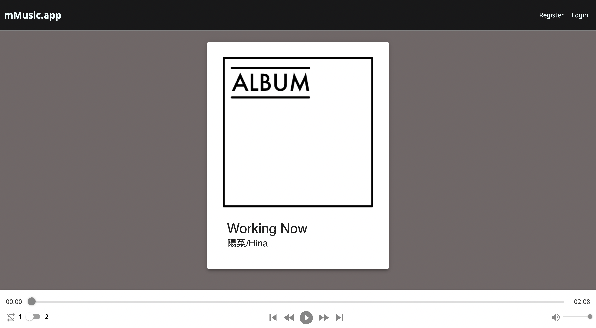
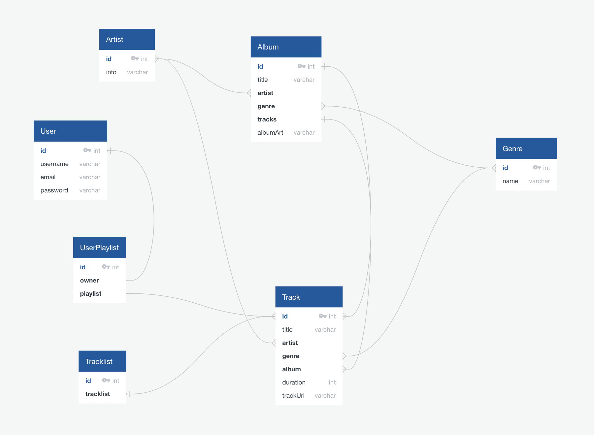

## SEI-project-four

# Project 4 - mMusic.App

## Overview

The final project on the Software Engineering Immersive course at General Assembly. I decided to go solo on this final project to test where I am in my ability. 

Link to deployed project [mMusic.App](https://mmusic-app.herokuapp.com/)  

## Table of Contents

- [Project Brief](#project-brief)
- [Technologies Used](#technologies-used)
- [Usage](#usage)
- [Comments/Bugs](#bugs)
- [Reflections](#reflections)
- [Dev Journal](#dev-journal)
- [Potential Future Updates](#potential-future-updates)

## Project Brief

Solo project  
Time frame: approx 1 week  
Brief: Build a full stack application  
- Build a full-stack application by making your own backend and your own front-end
- Use a Python Django API using Django REST Framework to serve your data from a Postgres database
- Consume your API with a separate front-end built with React

Wireframe & Entity relationship diagram
  

Wireframe

Entity relationship diagram

## Technologies Used

#### Languages and Framework

#### Backend

#### Testing  

  

#### Dev-Tools
 

## Usage

### mMusic.App

mMusic.App is a music player that plays preset music tracks, registered users can access more detailed information on the artist or the tracks. 

#### Audio player

- A simple audio player that displays the current track and some basic details

## Comments/ Bugs

- In its current form, no bugs to report
- Audio player ended up different from the original plan, would definitely return and implement lost features without the time restraint

## Development Reflections

- Had some big ambitions but ultimately I didn’t plan far enough ahead for the features I wanted to implement. The result was a simple audio player instead of what I ultimately wanted, which was: 
- To be able to toggle between different ambient track lists.
- Not allow non registered users access to the complete playlist
- Allow registered users to create custom playlists
- I spent too much time on trying to figure out how to code my own audio player instead of utilising a package which meant I had to deviate from my original idea. 
Overall it was a great learning experience on the necessity of good planning and time management.

### Challenges

Trying to code the actually audio player from scratch was probably not the best use of time
Time management. If I used at package instead of trying to code from scratch a lost of the missing features may have been implemented

### Wins

A major lesson learnt about the importance of careful planning and not being stubborn over a problem that could be solved easily with an existing solution
Adapting the typescript code back into JSX so the media player controls will function properly
Custom authentication using JWT instead of the default django authentication
Being able to plan and build a music app when a few months prior, I wouldn’t even know where to start

## Dev Journal

### Approach
For my final project I decided to go solo to test where I am right now. I chose to make a music app with an ambiance toggle. Unregistered members will have limited functionality while registered and logged in members will have access to more features.
As with the previous project I will tackle this from the back end first then focus on the front end. 

 
#### Day 1 - Planning and setup

Setup git repo files - main, development, feature branches
Setup project files
Created all the apps
Custom authentication
JWT_auth
Albums
Artists
Genres
Projects
Tracklists
Tracks
userPlaylists

#### Day 2 - backend coding

Setup all the admin, apps models, urls and views files for the created apps
Creating the corresponding relationships according to my ERD

#### Day 3 - Seeding and testing

Back end complete
Created superuser admin and regular user
Downloaded some free creative commons licensed music to use for my app.
Used cloudinary to store my files
Using tablePlus and django admin to seed and test data.
Seeding data had to be done in the correct order otherwise if a required entity relationship didn’t exist I couldn’t create a new entry

#### Day 4 - Front end start

Setup React component files
Auth, Helpers, utilities
Home, musicDeck, pageNavBar, singleArtist, profile

Setup app.js routing
Completed basic navigation
Completed register page and login page - had to go back into the back end and fix a casing issue that prevented me from submitting the form for registration and login

#### Day 5 - Building the audioplayer  

Spent about half a day researching various React audio players and also ways I can code a custom audio player, eventually found a tutorial to code a player that was customisable and would meet my needs.
Began a quick code along.

#### Day 6 - Reset…

I spent the better part of last night and all of today trying to code a custom audio play but ran into quite a few issues trying to make it function.
One factor is trying to access music from the back end and displaying the information on the player
Progress slider not functioning properly
Audio length tracking issues

I spent too much time trying to fix what's currently beyond my current learning, so at this point I must concede and utilise an audio player package if I want to deliver a minimum viable product. In future I hope to revisit this and code a completed custom audio player.

#### Day 7 - Styling

I spent a little too much time over the custom audio player that I need to cut some features from my app. Unfortunately it has become just a regular audio player without the ambiance selection feature I wanted. In the end this project ended up more like a work in progress rather than a completed app but it was a great learning experience.

## Potential future updates

Improvements

  - [ ] Fulfil original idea
  	- [ ] Limited operation for non registered users
  	- [ ] Ambiance toggle
 	- [ ] Registered user playlist toggle
	- [ ] Registered user playlist creation
	- [ ] Detailed music deck information
	- [ ] improve styling

